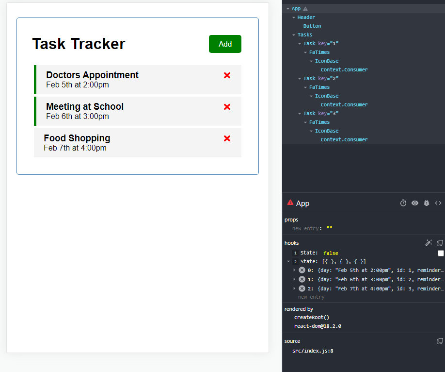
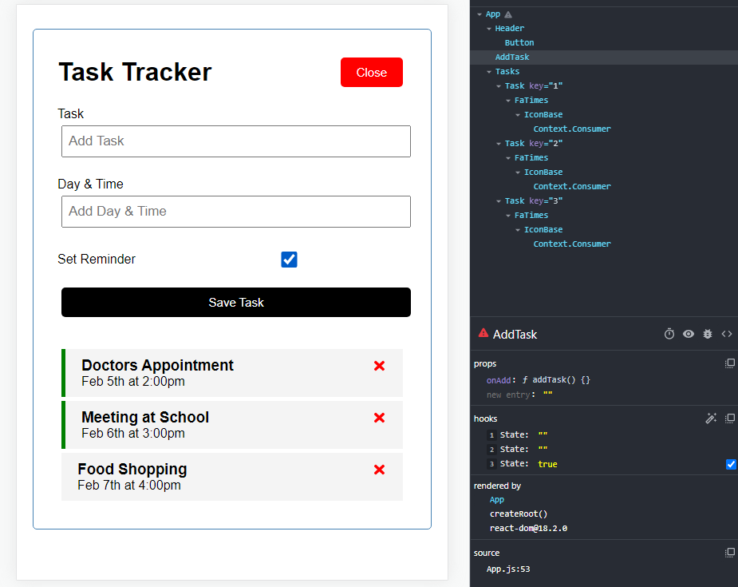

# Task Tracker App

This is the project includes the react ui as well as JSON-server for our mock backend





## Usage

### Install dependencies

```
npm install
```

### Run React dev server (http://localhost:3000)

```
npm start
```

### Run the JSON server (http://localhost:5000)

```
npm run server
```

### To build for production

```
npm run build
```

## 👤 Author 
Edward Yara  
- GitHub: [@oluyaratosin123](https://github.com/oluyaratosin123)
- Twitter: [@TOluyara](https://twitter.com/TOluyara)
- LinkedIn: [LinkedIn](https://www.linkedin.com/in/edward-oluyara/)

## Contributing :handshake:
Contributions, issues, and feature requests are welcome!

## Show your support
Give a :star: if you like this project.

## Acknowledgments
* Original tutorial [YouTube crash course](https://www.youtube.com/watch?v=w7ejDZ8SWv8)
